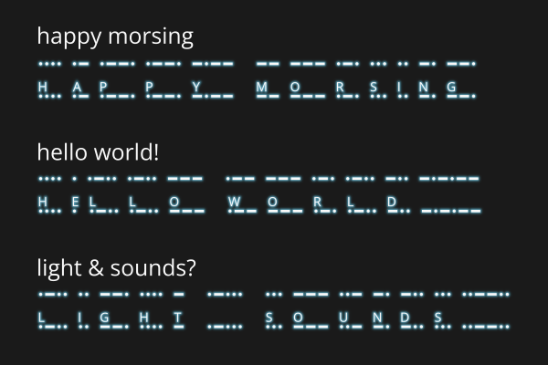
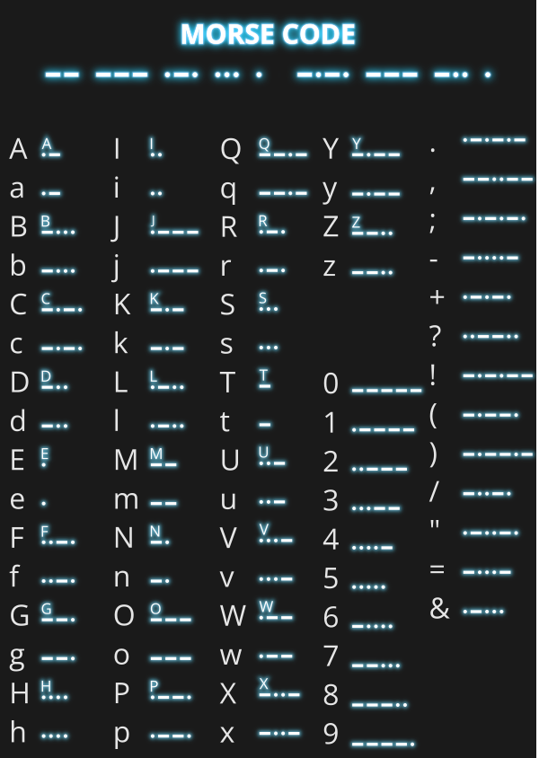

# font _Morse Code_
 

## background and features
Morse Code is the first font I ever created. I did this using the free programs [Inkscape 1.2.2](https://inkscape.org/) and [FontForge](https://fontforge.org/).

This font translates the Latin letters a-z, the digits from 0-9 and a few special characters into _Morse Code_. The uppercase letters A-Z are translated in the same way as the lowercase letters, but the coded latin letter is displayed additionally. The font is designed so that the letters are displayed above the corresponding Morse Code and the height remains the same on which the Morse Code is displayed - for better reading. This can be used e.g. for practice purposes or solution hints; e.g. Morse Code to be read in lower case letters as a practice exercise and solutions to these exercises in latin upper case letters. Thus the Morse Code would be readable in addition to the coded message.

The ITU-Code is used, just for clarity.

## credits
- Morse, Samuel Finley Breese (1791-1872)

- Font used in the uppercase letters: [Open Sans](https://www.1001freefonts.com/de/open-sans.font), Steve Matteson (Public domain, GPL, OFL)

- [@Create For Free](https://www.youtube.com/@CreateForFree) (YouTube): Make Your Own Font in Inkscape: [https://www.youtube-nocookie.com/embed/MHwLLJC9wUw](https://www.youtube-nocookie.com/embed/MHwLLJC9wUw); retrieved on 2023/02.

- [@Create For Free](https://www.youtube.com/@CreateForFree) (YouTube): Typography Template Inkscape to FontForge: [https://www.youtube-nocookie.com/embed/fTTq6of99tM](https://www.youtube-nocookie.com/embed/fTTq6of99tM); retrieved on 2023/02.

## licence
Creative Commons Attribution-NonCommercial 4.0 International [(CC BY-NC 4.0) ](https://creativecommons.org/licenses/by-nc/4.0/)

## screenshots

